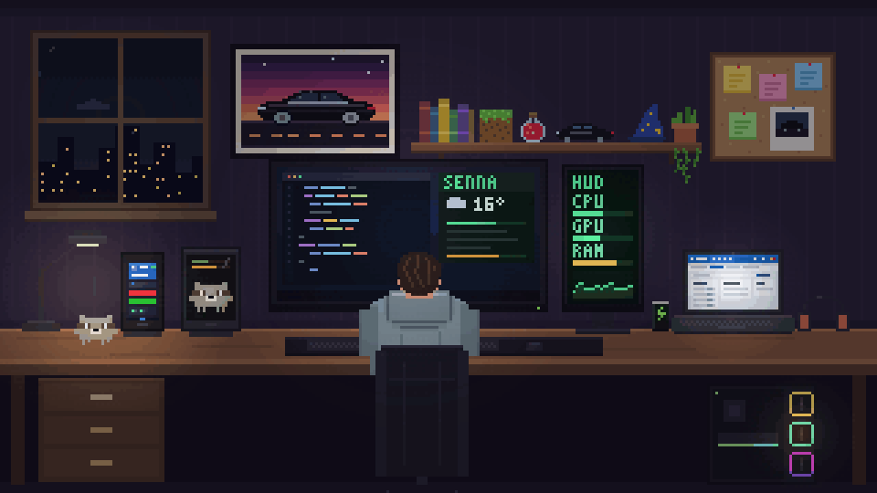

  

  Desenvolvedor <b>C# e .NET</b>, Pleno III na <b>Símix Sistemas</b>, em Canoas (RS). 
  Entrei em 2020 no suporte, configurando relógio de ponto, e cheguei aqui aprendendo direto da documentação.

  <a href="https://suiciniv-dev-apps.pages.dev/">Portfólio</a> ·
  <a href="https://www.linkedin.com/in/viniciuspiresdasilva/">LinkedIn</a> ·
  <a href="https://github.com/suiciniv-dev">GitHub pessoal</a>

### Stack

              

### Trilha do mago

<code>Aprendiz</code> → <code>Iniciado</code> → <code>Adepto</code> → <code>Mago</code> → <b><code>Arcanista III</code></b> → 🔒 <code>Arquimago</code>

estágio no suporte · qualidade · implantação · desenvolvedor júnior · Pleno I, II e III · o próximo degrau

 

<picture>
  <source media="(prefers-color-scheme: dark)" srcset="https://raw.githubusercontent.com/simix-viniciussilva/simix-viniciussilva/output/snake-dark.svg">
  
</picture>

No meu tempo livre eu faço o <a href="https://banditboard.pages.dev/">Banditboard</a>, o Senna e o ControlSensors HUD. O guaxinim aí em cima é o Racco. 🦝
